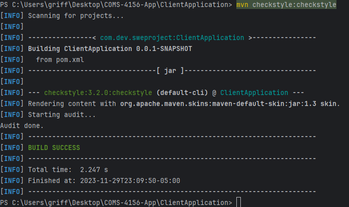
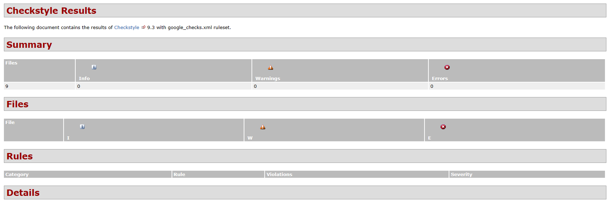

# COMS-4156-App
This is the GitHub repository for the **app portion** of the Team Project associated with COMS 4156 Advanced Software Engineering. Our team name is TheJavaEngineers and the following are our members: Griffin, Mohsin, Jeannie, Michael, and Abenezer.

## Viewing the Service Repository
Please use the following link to view the repository relevant to the service: https://github.com/griffinnewbold/COMS-4156-Service

## About our App
Our app targets **healthcare workers**, it is an app that allows for the management of documents in a variety of different ways. With a free and convenient way to manage documents, it is easier than ever for healthcare professionals to share comments on patient
diagnoses, prescriptions, and more.

All of that and how our app specifically works with our service is described in more detail below.
### App Functionality
1. Registering your Organization with our Service: Our app provides functionality for first time organizations to generate what we call a networkId which you would then paste it into the <code>NETWORK_ID</code> constant within the <code>GlobalInfo.java</code> file.
2. Registering new users with your organization: Users of the app can register with your organization using a very standard registration process, all we ask for is the following: Full Name, Email, Password, Birthday, Gender (Sex), and Profession within the organization.
3. Login to the app: Standard login procedure, requests the username and password of the specific user.
4. View a Document: Once on the user dashboard you can click on any of the presently loaded documents to view it.
    * Download the document: Click the download button and you will receive a downloaded txt file containing the document's contents.
    * Update the file: Choose a file and click upload to overwrite the current version of the document. Don't worry the old version will be saved!
    * Share the document: Choose a member of your organization, who does not currently have access to the document to be granted access to the document.
    * Download a previous version of the document: Choose which revision number you'd like, with 1 being the earliest and then click download to receive it as a txt file.
    * Compare with another document: Choose another document from the dropdown and click Compare to be shown a comparison of the two documents as well as their contents.
    * Delete the document: Click the delete button to remove the document, be careful as once you click it, there is no going back!
5. Search for a Specific Document: Type into the search bar keywords for your title and it will filter out any result that does not have at least a partial match. 
6. Upload a brand new Document: Select a file and assign it a title and click upload! NOTE: There is a maxiumum file limit of 1000KB!!!!
7. Logout: Standard Logout, returns you to the homepage of the webapp.
### How it works with our Service
To begin we must acknowledge that there is a frontend and a backend (this is true of any app but I digress) When a user performs an action on the frontend a request is sent to the backend of our app, the backend then (if necessary) makes a call to our service
and retrieves the result. The result is then processed and sent to the frontend for further process and any updates that need to occur as a result. 
### What makes our App Better/Faster/Cheaper than prior Solutions
Well to begin our app is 100% free to use! On top of that we are not profit driven at all so we are not selling your data to third-parties to make a quick buck so when we say free we really mean free! Our app also offers more features right out of the gate when it comes to document management than competitors and common tasks like comparing documents is baked right into the app, so no need for third party software to do that bit for you. Due to our simplisitic UI, it is very intuitive to use and it is very lost to get lost within our app. 

## Building and Running a Local Instance
In order to build and use our service you must install the following (This guide assumes Windows but the Maven README has instructions for both Windows and Mac):

1. Maven 3.9.5: https://maven.apache.org/download.cgi Download and follow the installation instructions, be sure to set the bin as described in Maven's README as a new path variable by editing the system variables if you are on windows or by following the instructions for MacOS.
2. JDK 17: This project used JDK 17 for development so that is what we recommend you use: https://www.oracle.com/java/technologies/javase/jdk17-archive-downloads.html
3. IntelliJ IDE: We recommend using IntelliJ but you are free to use any other IDE that you are comfortable with: https://www.jetbrains.com/idea/download/?section=windows
4. When you open IntelliJ you have the option to clone from a GitHub repo, click the green code button and copy the http line that is provided there and give it to your IDE to clone.
5. Once the entire project is cloned into a directory of your choice please open in IntelliJ as a project the <code>ClientApplication</code> folder specifically.
6. Go into <code>GlobalInfo.java</code> and alter the <code>SERVICE_IP</code> constant with the IP of the service, by default it assumes local host, if running a cloud based instance of the service please use that address instead keep the format consistent: "http://IP"
7. Please make sure you followed the Build Instructions on the other linked repository first, as the service must be operational prior to launching the client app.
8. You can then build the application by using <code>mvn -B package --file pom.xml</code> in the terminal and then execute the ClientApplication.java file to launch the app.
9. The web app can be accessed at localhost:8081 so once you confirm the code is running navigate there in your browser to begin interacting with the web app.
10. You can run checkstyle by using the <code>mvn checkstyle:checkstyle</code> or the <code>mvn checkstyle:check</code> commands in the terminal.

## Running Tests
We have a large suite of tests located in the 'src/test' directory, you can right click any of those .java files and click run to see the suite of tests execute, all tests execute by running <code>mvn -B package --file pom.xml</code> command in the
terminal as well.
   
## End to End Testing
In order to properly perform end to end tests please follow the list and compare the results of the actions performed 
to the expected results provided. 

The following consists of a series of tests you should perform in order to ensure everything is working 
properly. Please complete the following checklist IN ORDER to ensure the results are as they are meant 
to be.

0. Please ensure no other applications are running that use up ports on your system. 

1. Run the Service portion of the System
   - Please view the build guide on the linked repository at the top of the README for instructions on 
     how to do this, if you believe the service is running on a cloud instance please confirm that prior
     to skipping the previous details mentioned. 

2. Confirm the proper configuration for SERVICE_IP and NETWORK_ID in ClientApplication/src/main/java/com/dev/sweproject/GlobalInfo.java 
   - The SERVICE_IP should be whereever the service is being hosted, if local host please use "http://127.0.0.1:PORT" where you should replace port with
     the port the service is running on, by default it should be 8080.
   - NETWORK_ID should be a String detailing which network you'd like to be accessing, for purposes of this manual test set please set it to "demoEndtoEndTest"

3. Run the App portion of the System
   - Please view the build guide above in order to figure out how to run the app

4. Navigate to localhost:8081 within your preferred browser
   - We configured our application properties to manually run on port 8081 to avoid potential conflicts 
   - The expected result of this action should be the display of the welcome page, headlined with "Welcome to HealthDocs"

5. Click on "Generate a Network Key"
   - The expected result of this should be a redirect to localhost:8081/generate-key and the page should be headlined with
     "Generate Network Key"

5b. Click "Generate Network Key"
   - The expected result should be the updated page with a new String dynamically placed on top of the button previously clicked. 

6.  Click the "Register" button on the bottom of the page
   - The expected result should be the redirect to localhost:8081/register and the page should be headlined with "Professional Registration"

   6b Fill out the registration form with the following information:
      Full Name: your name
      Email: your email but replace the .domain with ,domain
      Password: enter a desired password
      Birthday: enter 01-11-1111
      Gender: Choose Male or Female
      Profession: Select any of the presented choices
      Click register
         - The expected result is the refresh of the page with a new red text below the form stating "Please fill in all fields properly!"
   
   6c Fill out the registration form with the following information:
      Full Name: your name
      Email: your email
      Password: enter a desired password
      Birthday: enter 01/11/1111
      Gender: Choose Male or Female
      Profession: Select any of the presented choices
      Click register
         - The expected result is the refresh of the page with a new red text below the form stating "Please fill in all fields properly!"
   6d Fill out the registration form with the following information:
      Full Name: your name
      Email: your email
      Password: enter a desired password
      Birthday: enter 01-11-1111
      Gender: Choose Male or Female
      Profession: Select any of the presented choices
      Click register
         - The expected result is the redirect to the login page which is headlined with "Login"
   
   7a Fill out the login information with invalid credentials and click login
         - The expected result is the refresh of the page with a new red text below the form stating "Invalid credentials"
   7b Fill out the login information with the proper credentials of the user you registered in 6d
         - The expected result is the redirect to the dashboard page headlined with "Welcome username!"
   
   8 On your computer create a new txt file named whatever and provide it with the following sentence "This is my first upload! Test!"
   
   9 Click the Choose File button and select the file you created in 8 and after confirming the selection provide the document with the title "First Upload" 
     then click the Upload button
         - The expected result is the refresh of the current page which should now be populated with a single entry. 
   
   10 Click on the dashboard entry that has just appeared. Confirm that the preview matches the contents of what your document contained. View the
      document statistics below the preview window, confirm that all the details are correct, the creator should be your username, the word count 
      should match your document contents. 1 user should be able to see the document and there should be 0 previous versions on record. 
   
   11 Locate the Delete Document Button and Click it
         - The expected result is the redirect back to the dashboard as described in the result from 7b
   
   12 Click the Upload button
         - The expected result is a popup stating "You must select a document to upload."
   
   13 Click the logout button
         - The expected result is a redirect back to the homepage described in 4
   
   14 Click the login button and fill out the form with the following credentials:
      Email: testdummy@dummy.org
      password: testexercise
         - The expected result is a redirect to the dashboard described in 7b but this time the dashboard is prepopulated with 8 entries
   
   15 Using the search bar type in "Eighth"
         - The expected result is the dashboard page with a single entry titled "Eighth" on the screen. 
   
   16 Click on the displayed entry
         - The expected result is the redirect to the document page with the same kind of display as described in 10
   
   17 Click on the Choose Provider Dropdown and select any option that is present that is eligible to be selected and then click the share button to its immediate right
        - The expected result is the refresh of the page with a new user mentioned in the document statistics section.

18. Click on any of the following: share, compare, upload, download version
    - The expected result from any of these is a server popup stating you must perform another action prior to proceeding.

19. Click the big download button on the top below the Manage subheader
    - The expected result should be the document being downloaded to executing computer

20a Open up the document in a text editor and add some content, save the document then close the editor
20b Click choose file and select the editted version and click upload. 
    - The expected result should be the refresh of the page with the new document contents in the preview window and updated document stats

21 Click the previous version drop down and select the option presented and then click Download Version button to its immediate right
   - The expected result should be the document titled Eighth_v1.txt being downloaded to the executing computer

22 Select the Compare Documents dropdown and select Third and then click the Compare button to its immediate right
   - The expected result should be the redirect to a page headlined Compare with the initial documents on the left, the selected documents contents on the right and a summary
     of the stats and differences in the center of the page. 

23 Click the Back button and then the My Documents button in the Upper left and then click logout
   - The expected result is the return to the homepage

End of Testing

## Backend Checkstyle Report

## Continuous Integration Report
This repository using GitHub Actions to perform continous integration, to view the latest results go to the following link: https://github.com/griffinnewbold/COMS-4156-App/actions/workflows/maven.yml

Click on the latest job on the top under "X workflow runs" then Click 'build' under jobs finally click the drop down next to all the action items to read the logs made during their execution

For convenience a recent CI Report has been manually created and is available for view in the reports directory under the appropriately named file.

## A Final Note to Developers
This repository should serve as a sample of how one can use the software service located in the reposistory mentioned in the appropriately named section towards the top of this document there is many different ways to 
use the service to make different kinds of web apps for a multitude of different target demographics, please view the section titled "An Initial Note to Developers" in the other repository if you haven't done so already
for more details on how to develop your own app which makes use of our service. 

## Tools used 🧰
This section includes notes on tools and technologies used in building this project, as well as any additional details if applicable.

* Firebase DB 
* Maven Package Manager
* GitHub Actions CI
  * This is enabled via the "Actions" tab on GitHub.
  * Currently, this just runs a Maven build to make sure the code builds on branch 'main'.
* Checkstyle
  * We use checkstyle on the code's backend to ensure compilance with the standards set by Google in their Java style guide
* JUnit
  * JUnit tests get run automatically as part of the CI pipeline.

## Third Party API Documentation
We made extensive use of Firebase Realtime Database provided by Google for both the service portion and the app portion of the project, here is a link to the full 
documentation provided by Google on how to use the different components provided and gives insight into how we managed the development of this project while making use of it: https://firebase.google.com/docs/database/
